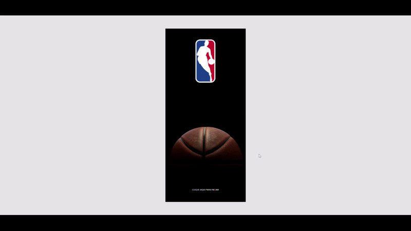

# Frontend Mentor - Intro component with sign up form solution

My mentor João Júnior, on the Programa Desenvolve 2022 - Grupo Boticário, challenged me to build this web page so here is my sollution!

## Table of contents

- [Overview](#overview)
  - [The challenge](#the-challenge)
  - [Screenshot](#screenshot)
  - [Links](#links)
- [My process](#my-process)
  - [Built with](#built-with)
  - [What I learned](#what-i-learned)
- [Author](#author)
- [Acknowledgments](#acknowledgments)

## Overview

### The challenge

Users should be able to:

- View the optimal layout for the site depending on their device's screen size
- Interact with elements on the page

### Screenshot

### Links

- Live Site URL: [GitHub Pages](https://guisilveira.github.io/NBA-App-Screen/)

## My process

### Built with

- Semantic HTML5 markup
- CSS custom properties
- Flexbox
- Mobile-first workflow

### What I learned

I learned so much about animations and how to make it more fluid. Also, i learned a lot about how to display the elements correctly on the screen.

## Author

- LinkedIn - [Guilherme Silveira](https://www.linkedin.com/in/guilherme-silveira-coutinho/)

## Acknowledgments

I want to give a huge thanks to my mentor João Júnior because He taught me a lot while I was building this project.
